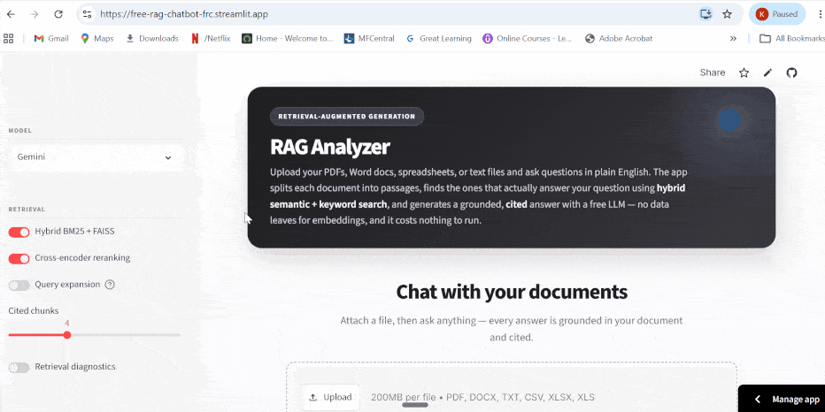

# Multi-File RAG Analyzer

A production-style RAG chatbot built with Streamlit, FAISS, SentenceTransformers, BM25, and cross-encoder reranking. Upload PDF, DOCX, TXT, CSV, XLSX, or XLS files and ask grounded questions with streaming answers and page-aware citations.

Built as a portfolio-ready retrieval system demonstrating document parsing, recursive chunking, local embeddings, vector indexing, hybrid retrieval, reranking, prompt grounding, citation UX, index caching, and persistent chat history — all at zero cost.

**▶ [Try the live demo](https://free-rag-chatbot-frc.streamlit.app/)**

## Demo

> _Attach a document, ask a question, and get a streamed answer with page-level citations._

## What It Does

- Upload multiple documents across common office formats.
- Extract and chunk text with overlap-aware recursive splitting.
- Embed chunks locally with `all-MiniLM-L6-v2` — no data sent to an embedding API.
- Store and search vectors with FAISS.
- Blend semantic search with BM25 keyword search for stronger recall.
- Rerank retrieved chunks with `cross-encoder/ms-marco-MiniLM-L-6-v2`.
- Generate grounded answers with Gemini 2.5 Flash or Groq-hosted Llama 3.3 70B.
- Stream responses into a clean, minimal chat UI.
- Show citations with exact retrieved snippets plus PDF page, spreadsheet sheet, row range, or DOCX paragraph metadata.
- Cache FAISS indexes so repeated uploads skip re-indexing.
- Persist chat history per document set across sessions.
- Export chat transcripts as a styled PDF.

## Architecture

~~~mermaid
flowchart TD
    A[PDF / DOCX / TXT / CSV / XLSX] --> B[Text Extraction]
    B --> C[Recursive Chunking]
    C --> D[SentenceTransformer Embeddings all-MiniLM-L6-v2]
    D --> E[Cached FAISS Vector Index]
    C --> F[BM25 Keyword Index]
    E --> G[Top-k Semantic Retrieval]
    F --> H[Keyword Retrieval]
    G --> I[Hybrid Candidate Merge]
    H --> I
    I --> J[Cross-Encoder Reranking]
    J --> K[Grounded Context + Citations]
    K --> L[Gemini 2.5 Flash / Groq Llama 3.3 70B]
    L --> M[Streaming Answer]
    M --> N[Persistent Chat History]
~~~

## Demo Walkthrough

Test the app immediately with the sample files in `sample_docs/`:

- `ai_governance_policy.txt`
- `quarterly_business_summary.txt`
- `project_risks.csv`

1. Open the app — you land on a centered upload bar (no sign-in or API key needed).
2. Attach one or more files — a PDF report, a DOCX policy, a spreadsheet.
3. The app extracts text, builds chunks, creates local embeddings, and writes a FAISS index cache.
4. Ask your first question right there, e.g. `What are the main risks mentioned across these documents?`
5. The assistant retrieves evidence, reranks it, streams a grounded answer, and shows expandable citations.
6. Switch between Gemini and Groq anytime from the sidebar, or download the full conversation as a PDF.

## Example Questions

- `Summarize the uploaded documents in five bullet points.`
- `What are the key risks, deadlines, or obligations mentioned?`
- `Compare the financial figures in the spreadsheet.`
- `Which document discusses implementation details?`
- `What evidence supports this answer? Cite the source chunks.`
- `What information is missing from these documents?`
- `Which project risks are still open and who owns them?`
- `What controls does the AI governance policy require?`

## Retrieval Pipeline

~~~text
Indexing (once per document set)
  -> text extraction
  -> recursive chunking
  -> SentenceTransformer embeddings (local, CPU)
  -> FAISS vector index + BM25 keyword index  [cached to disk]

Per query
  -> optional query expansion (LLM rewrites into query variants)
  -> FAISS vector search + optional BM25 hybrid merge
  -> optional cross-encoder reranking
  -> grounded context + citations
  -> streaming LLM answer
~~~

## Key Features

- Multi-format parsing for PDF, Word, text, CSV, and Excel files.
- Recursive chunking that preserves paragraphs, sentence boundaries, and overlap.
- Local CPU embeddings — document content stays on your machine.
- FAISS vector search using normalized inner product similarity.
- Content-hash based FAISS index cache in `.rag_cache/` — unchanged uploads skip re-indexing instantly.
- BM25 index cached per session — not rebuilt on every query.
- Optional BM25 + FAISS hybrid retrieval for stronger lexical and semantic matching.
- Optional cross-encoder reranking for more relevant final context.
- Optional query expansion for broader search coverage — works with both providers.
- Conversation memory using recent chat turns in the answer prompt.
- Persistent per-document chat history saved in `.chat_history/`.
- Streaming responses and expandable citation snippets.
- Apple-style minimalist UI with iMessage-style chat bubbles and a responsive, phone-friendly layout.
- One-click styled PDF export of the full conversation.
- Fully zero-cost stack — local embeddings, free Gemini tier, free Groq inference.

## Technology Stack

| Layer | Tools |
| --- | --- |
| UI | Streamlit |
| Document parsing | pypdf, python-docx, pandas, openpyxl, xlrd |
| Chunking | Custom recursive splitter |
| Embeddings | sentence-transformers — all-MiniLM-L6-v2 |
| Vector search | FAISS |
| Keyword search | rank-bm25 |
| Reranking | SentenceTransformers CrossEncoder |
| LLM | Gemini 2.5 Flash (Google AI Studio) or Llama 3.3 70B (Groq) |
| PDF export | fpdf2 |
| Persistence | Local FAISS cache and JSON chat history |

## Why This Is Portfolio-Ready

This project demonstrates practical RAG engineering decisions that appear in production systems:

- **FAISS indexing:** fast approximate nearest-neighbour search with normalized inner product.
- **Hybrid retrieval:** semantic + lexical signals combined for stronger recall than either alone.
- **Cached BM25:** index built once per session rather than rebuilt on every query.
- **Reranking:** cross-encoder re-scores the top candidates before passing context to the LLM.
- **Grounded prompting:** the model is instructed to answer only from retrieved evidence with inline citations.
- **Page and sheet-aware citations:** traceable sources down to PDF page, spreadsheet row range, or DOCX paragraph.
- **Content-hash caching:** FAISS index is keyed by file content hash — unchanged uploads are instant.
- **Multi-LLM support:** Gemini and Groq are interchangeable at runtime via the sidebar.
- **Graceful degradation:** retrieval failures, reranker errors, and LLM rate limits are handled without crashing.
- **Exportable transcripts:** chat history downloadable as a styled PDF (Markdown fallback).

## Quick Start

1. Install Python 3.9 or newer.
2. Install dependencies:

~~~bash
pip install -r requirements.txt
~~~

3. Get a free API key:
   - **Gemini:** [aistudio.google.com/app/apikey](https://aistudio.google.com/app/apikey)
   - **Groq:** [console.groq.com/keys](https://console.groq.com/keys) — create a free API key (no credit card)

4. Run the app:

~~~bash
streamlit run free_rag_chatbot.py
~~~

5. Add your keys to `.streamlit/secrets.toml` (the app reads them automatically — there is no in-app key prompt):

~~~toml
GEMINI_API_KEY = "your_gemini_key_here"
GROQ_API_KEY = "your_groq_key_here"
~~~

See `.streamlit/secrets.toml.example` for the full template. Only the provider you select in the sidebar needs its key set.

## Free-Tier Notes

- **Gemini** free tier rate-limits requests. Turn off Query Expansion to halve API calls per question. If the free quota runs out, switch to Groq in the sidebar.
- **Groq** is free with no billing required — just a free API key from console.groq.com. Generous limits (~14,400 requests/day, 30 per minute) and very fast inference with no cold-start delay.

## Reliability Notes

The app degrades gracefully instead of crashing on common failure modes:

- **Upload limits:** 50 MB per file, 150 MB total. Oversized files are skipped with a clear message.
- **Per-file chunk cap:** large documents are truncated to `MAX_CHUNKS_PER_FILE` chunks with a visible warning.
- **Retrieval failures:** reranker errors fall back to score-based ranking rather than crashing.
- **LLM streaming retries:** transient errors are retried automatically; partial answers are preserved.
- **Encoding fallbacks:** `.txt` and `.csv` files that are not UTF-8 fall back to Latin-1.
- **Corrupted chat history:** detected and replaced with a fresh session instead of crashing.
- **HTML escaping:** uploaded file names are escaped before rendering in the stats panel.

## Deployment

Deploy on Streamlit Community Cloud in minutes:

1. Push this repository to GitHub.
2. Go to [share.streamlit.io](https://share.streamlit.io) and create a new app from the repo.
3. Set the main file path to `free_rag_chatbot.py`.
4. Add your secrets under **Settings → Secrets**:

~~~toml
GEMINI_API_KEY = "your_gemini_key_here"
GROQ_API_KEY = "your_groq_key_here"
~~~

5. Deploy — the app will install dependencies and start automatically.

## Local Runtime Artifacts

The app creates these folders during use:

- `.rag_cache/` — FAISS indexes and chunk metadata.
- `.chat_history/` — persistent chat transcripts per document set.

Both are gitignored and safe to delete to free up disk space.

## Recent Upgrades

- Added Groq (Llama 3.3 70B) as a free, fast fallback provider alongside Gemini.
- Updated Gemini model to gemini-2.5-flash (current stable free-tier model).
- Redesigned UI with an Apple-style hero banner, iMessage-style chat bubbles, and hover-lift cards.
- Moved the uploader to a centered, ChatGPT-style search bar with a first-question composer.
- Removed all in-app API-key prompts — keys are read from Streamlit secrets automatically.
- Made the layout responsive for phones, with an in-app hint to open the collapsed sidebar.
- Switched transcript export from Markdown to a styled, black-header PDF.
- BM25 index now cached per session — built once, not rebuilt on every query.
- Query expansion now works with both Gemini and Groq providers.
- Added secrets.toml.example for streamlined local setup.
- Relaxed numpy version pin to support Python 3.14+.
